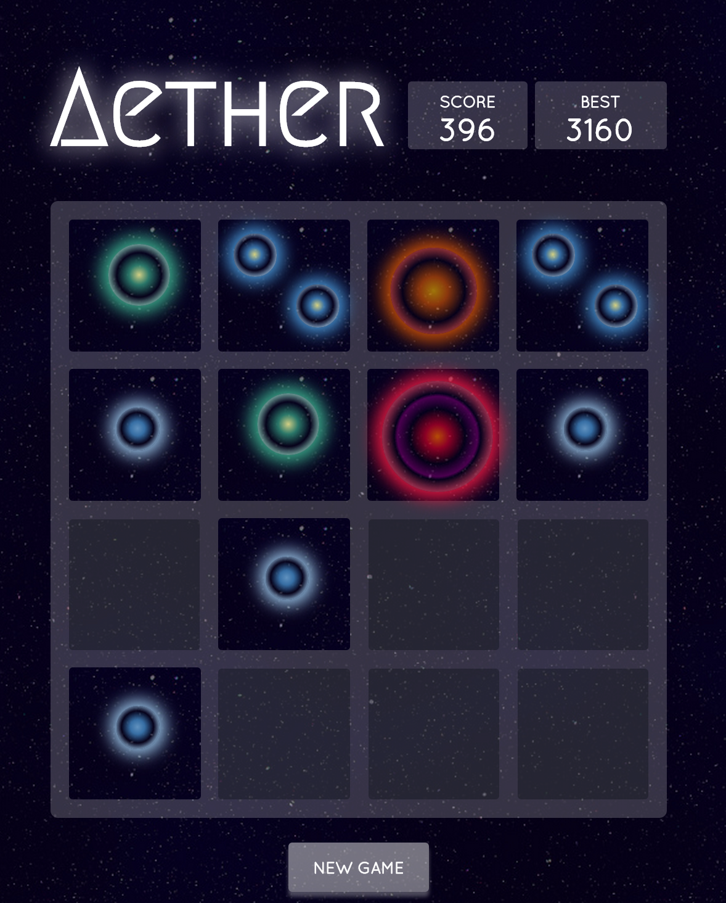

#Aether
A fork of Gabriele Cirulli's [2048](http://gabrielecirulli.github.io/2048/) customised to resemble [Osmos](http://www.osmos-game.com/) by [Hemisphere Games](http://www.hemispheregames.com/).

Developed for my User Experience in Games honours module at UCT. [Play here](http://justshiv.github.io/aether/)

### Screenshot
Showing in-game play. Coming shortly.

  

## License
This fork of 2048 is licensed under the [MIT license.](https://github.com/gabrielecirulli/2048/blob/master/LICENSE.txt)